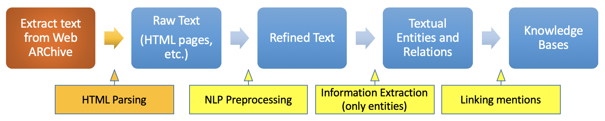

# WDPS - Group 1901
This repository contains the Lab Assignment of the 2019 edition of the course Web Data Processing of the Master Computer Science at the Vrije Universiteit Amsterdam.

# Project Usage
The project can be used in different environments, each supported environment is listed below with a description of the setup commands:
* **Local machine**: (1) activate any virtual environment you want (2) run `./setup-env-local.sh`. Note: do not forget to activate your environment when running the project! 
* **DAS4 Node***: run `./setup-env-das.sh`, and run `. activate-env-das.sh` before executing the project on a node (not required when executing in the cluster).
* **DAS4 Spark Cluster**: run `./setup-env-das.sh`.

To run the project either **locally or on a DAS4 node**, run the command: `python3 A1.py WARC_ARCHIVE OUTPUT_FILE ES_HOST`.
* Replace `WARC_ARCHIVE` with the archive that you want to link (e.g. `data/sample.warc.gz`). It is also possible to input an HDFS file in the following matter: `hdfs://..`.
* Replace `OUTPUT_FILE` with the file to which you would like to output (e.g. `results.tsv`).
* Replace `ES_HOST` with the host and port on which the Elastic Search instance is running (e.g. `localhost:9200`).

Additionally, it is possible to limit the sample size by passing the `SAMPLE_SIZE` environment variable. This will make the system only process `N` number of WARC archives (e.g. `SAMPLE_SIZE=N python3 A1.py WARC_ARCHIVE OUTPUT_FILE ES_HOST`). It is also possible to automatically calculate the resulting F1 score by prefixing `CALC_SCORE=True` like this: `CALC_SCORE=True SAMPLE_SIZE=N python3 A1.py WARC_ARCHIVE OUTPUT_FILE ES_HOST`.

To run the project on the **DAS4 Spark Cluster** run: `./submit.sh`. In order to get the `.tsv` file a merge of the cluster output has to be done, run this merge by simply executing `python3 merge.py`, this will output the `results.tsv` file.

# Knowledge Acquisition

This project follows the pipeline described in the lectures of the WDPS course as displayed in the image above. Note that there is one additional step added marked in orange. This step is the extraction of raw text from the Web ARChive(WARC).

## Step 1: Extract text from Web ARChive
This task will extract all the raw text from each web page out of the WARC. This is done by the WARCExtractor, found in `WarcExtractor.py`, which parses the HTML inside of each WARC and checks if its valid and contains enough information.

The next step is to process the HTML and extract the raw text, this is done by the TextExtractor, found in `TextExtractor.py`. The TextExtractor uses the BeautifulSoup library to do the parsing and text extraction. Additionally it uses Spacy, which is an NLP library, to parse the different sentences found inside of the raw text.

## Step 2: NLP Preprocessing and Information Extraction
Next, the raw text is converted to refined text, which is done using an NLP library. The actual NLP preprocessing is performed by the class SpacyNLP, found in `SpacyNLP.py` (also utilizing Spacy).  

The raw text is put through the Spacy NLP pipeline, this pipeline tokenizes the text, performs part-of-speech tagging and finally performs Named Entity Recognition (NER). The extracted entity mentions are put through a series of sanity checks to reduce noise (e.g. an entity mention must contain at least one alpha character).

Note that the two steps, NLP preprocessing and Information extraction, have been merged together.

## Step 3: Linking
Next, the entity mentions are linked to the knowledge base. The knowledge base is Freebase and is accessed through an Elastic Search server. The linking process is divided into three parts, each part is briefly described below. 

### Candidate Entity Generation
The candidate entities for each entity mention are generated by performing a query on Freebase through the Elastic Search server. This query contains the name of the entity mention and returns the candidate entities found in Freebase sorted by the Elastic Search score. The Elastic Search score represents how relevant a match is to the query. 

### Entity Ranking
The entity ranking is performed using two features, the Sorensen Dice coefficient and the Elastic Search score. For each candidate entity the Sorensen Dice coefficient is computed, it gives a quantified measure of the similarity between the name of the entity mention and the name of the entity candidate. The candidate entities are sorted on Sorensen Dice coefficient and Elastic Search score and the first candidate entity is picked.

### Unlinkable Mention Prediction
When the entities are retrieved from Elastic Search, a threshold is used (Elastic Search score >= 6). An entity mention is dropped and considered unlinkable when no candidate entities are found, this is either because there were no entity candidates found in Freebase or no entity candidate met the Elastic Search score threshold.

## Step 3: Output
The results of the knowledge acquisition pipeline can be found in the `OUTPUT_FILE`.

The output follows the following format: `<WARC_ID>\t<NLP_MENTION>\t<FREEBASE_ID>\n`
* Where the `WARC_ID` is the crawled web page ID as provided in the WARC.
* Where the `NLP_MENTION` is the entity mention found by Spacy.
* Where the `FREEBASE_ID` is the ID as found during the linking phase in the Freebase knowledge base.

# Results
The F1 score when executing the project on the sample archive provided by the course equals to: `0.23906`.